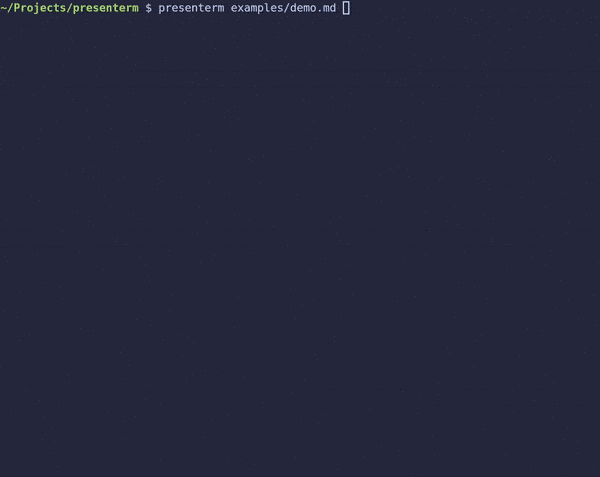

presenterm
---

A terminal based slideshow tool.

---

_presenterm_ lets you define presentations that run in your terminal.

This is how the [demo presentation](examples/demo.md) looks like:

# Installation

The recommended way to install _presenterm_ is to download the latest pre-built version for your system from the 
[releases](https://github.com/mfontanini/presenterm/releases) page.

For other alternative ways to install it, visit the [installation](/docs/install.md) docs.

# Features

* Define your presentation in a single markdown file.
* [Image rendering support](/docs/intro.md#images) for _iterm2_, terminals that support the _kitty_ graphics protocol, 
  and _sixel_.
* [Customize your presentation's look](/docs/themes.md) by defining themes, including colors, margins, layout 
  (left/center aligned content), footer for every slide, etc.
* Code highlighting for a [wide list of programming languages](/docs/highlighting.md).
* [Selective/dynamic](/docs/highlighting.md#selective-highlighting) code highlighting such that only a subset of the 
  lines are highlighted at a time, and different sets of lines are highlighted as you move your slides forward.
* Configurable [column layouts](/docs/layouts.md) that let you structure parts of your slide into columns.
* Support for [_LaTeX_ and _typst_ code block rendering](/docs/latex.md) so you can define formulas as text and have 
  them automatically render as images when rendering a presentation.
* Support for an [introduction slide](/docs/intro.md#introduction-slide) that displays the presentation title and your 
  name.
* Support for [slide titles](/docs/intro.md#slide-titles).
* Support for [shell code execution](/docs/highlighting.md#executing-code).
* Support for [generating PDF files](/docs/pdf-export.md) from presentations to share with other people.
* Support for [pauses](/docs/intro.md#pauses) in between each slide so that it progressively renders for a more 
  interactive presentation.
* Automatically reload your presentation every time it changes for a fast development loop.
* [Terminal colored themes](/docs/themes.md#built-in-themes) that use your terminal's color scheme. This means if your 
  terminal uses transparent backgrounds or images as background, those will be implicitly set as the background of your 
  presentation.

See the [introduction page](/docs/intro.md) to learn more.

## Images

Images are supported if you're using iterm2, a terminal the supports the kitty graphics protocol (such as 
[kitty](https://sw.kovidgoyal.net/kitty/), of course), or one that supports sixel. 

Read more about images [here](/docs/intro.md#images).

## Hot reload

Unless you run in presentation mode by passing in the `--present` parameter, _presenterm_ will automatically reload your 
presentation file every time you save it. _presenterm_ will also automatically detect which specific slide was modified 
and jump to it so you don't have to be jumping back and forth between the source markdown and the presentation to see 
how the changes look like.

## Column layouts

Column layouts allow you to organize content into columns. You can define 2 or more columns, choose how wide you want 
them to be, and then put any content into them. For example:

See the [documentation](/docs/layouts.md) on layouts to learn more.

## Shell code execution

Any shell code can be marked for execution, making  _presenterm_ execute it and render its output when you press ctrl+e. 
In order to do this, annotate the code block with `+exec` (e.g. `bash +exec`). **Obviously use this at your own risk!**

See more details on this [here](docs/highlighting.md).

# Docs

Some docs on how to configure _presenterm_ and how it works internally can be found [here](docs/README.md).

# Acknowledgements

This tool is heavily inspired by:

* [slides](https://github.com/maaslalani/slides/)
* [lookatme](https://github.com/d0c-s4vage/lookatme).
* [sli.dev](https://sli.dev/).

Support for code highlighting on many languages is thanks to [bat](https://github.com/sharkdp/bat), which contains a 
custom set of syntaxes that extend [syntect](https://github.com/trishume/syntect)'s default set of supported languages. 
Run `presenterm --acknowledgements` to get a full list of all the licenses for the binary files being pulled in.

