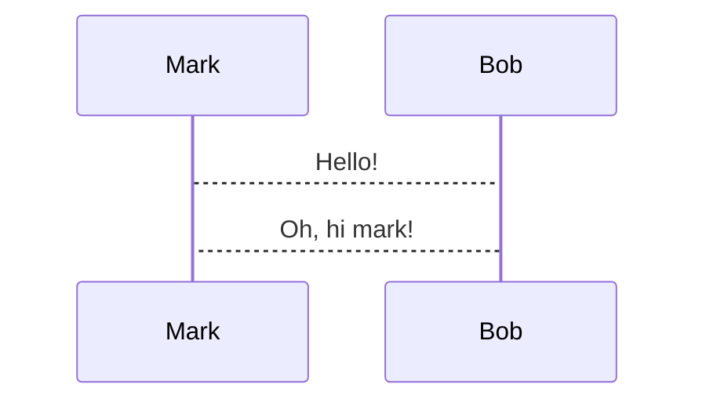

## Mermaid

[mermaid](https://mermaid.js.org/) snippets can be converted into images automatically in any code snippet tagged with 
the `mermaid` language and a `+render` tag:

~~~markdown

~~~

Mermaid diagrams are rendered in-process via the [merman](https://github.com/Latias94/merman) Rust library. No external 
`mmdc` / mermaid-cli installation or browser is required.

Mermaid graphs are rendered asynchronously by a number of threads that can be configured in the 
[configuration file](../../configuration/settings.md#snippet-rendering-threads). This configuration value currently 
defaults to 2.

The size of the rendered image can be configured by changing:
* The `mermaid.scale` [configuration parameter](../../configuration/settings.md#mermaid-scaling).
* Using the `+width:<number>%` attribute in the code snippet.

For example, this diagram will take up 50% of the width of the window and will preserve its aspect ratio:

~~~markdown

~~~

It is recommended to change the `mermaid.scale` parameter until images look big enough and then adjust on an image by 
image case if necessary using the `+width` attribute. Otherwise, using a small scale and then scaling via `+width` may 
cause the image to become blurry.

## Theme

The theme of the rendered mermaid diagrams can be changed through the following [theme](../themes/introduction.md) 
parameters:

* `mermaid.background` the background color used when rasterizing (e.g., `transparent`, `red`, `#F0F0F0`).
* `mermaid.theme` the [mermaid theme](https://mermaid.js.org/config/theming.html#available-themes) to use.

## Always render diagrams

If you don't want to use `+render` every time, you can configure which languages get this automatically via the [config 
file](../../configuration/settings.md#auto_render_languages).
