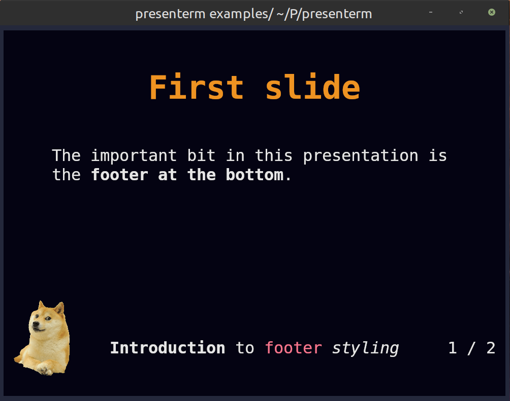

# Theme definition

This section goes through the structure of the theme files. Have a look at some of the [existing 
themes](https://github.com/mfontanini/presenterm/tree/master/themes) to have an idea of how to structure themes. 

## Root elements

The root attributes on the theme yaml files specify either:

* A specific type of element in the input markdown or rendered presentation. That is, the slide title, headings, footer, 
  etc.
* A default to be applied as a fallback if no specific style is specified for a particular element.

## Alignment

_presenterm_ uses the notion of alignment, just like you would have in a GUI editor, to align text to the left, center, 
or right. You probably want most elements to be aligned left, _some_ to be aligned on the center, and probably none to 
the right (but hey, you're free to do so!).

The following elements support alignment:
* Code blocks.
* Slide titles.
* The title, subtitle, and author elements in the intro slide.
* Tables.

### Left/right alignment

Left and right alignments take a margin property which specifies the number of columns to keep between the text and the 
left/right terminal screen borders. 

The margin can be specified in two ways:

#### Fixed

A specific number of characters regardless of the terminal size.

```yaml
alignment: left
margin:
  fixed: 5
```

#### Percent

A percentage over the total number of columns in the terminal.

```yaml
alignment: left
margin:
  percent: 8
```

Percent alignment tends to look a bit nicer as it won't change the presentation's look as much when the terminal size 
changes.

### Center alignment

Center alignment has 2 properties:
* `minimum_size` which specifies the minimum size you want that element to have. This is normally useful for code blocks 
  as they have a predefined background which you likely want to extend slightly beyond the end of the code on the right.
* `minimum_margin` which specifies the minimum margin you want, using the same structure as `margin` for left/right 
  alignment. This doesn't play very well with `minimum_size` but in isolation it specifies the minimum number of columns 
  you want to the left and right of your text.

## Colors

Every element can have its own background/foreground color using hex notation:

```yaml
default:
  colors:
    foreground: ff0000
    background: 00ff00
```

## Default style

The default style specifies:

* The margin to be applied to all slides.
* The colors to be used for all text.

```yaml
default:
  margin:
    percent: 8
  colors:
    foreground: "e6e6e6"
    background: "040312"
```

## Intro slide

The introductory slide will be rendered if you specify a title, subtitle, or author in the presentation's front matter. 
This lets you have a less markdown-looking introductory slide that stands out so that it doesn't end up looking too 
monotonous:

```yaml
---
title: Presenting from my terminal
sub_title: Like it's 1990
author: John Doe
---
```

The theme can specify:
* For the title and subtitle, the alignment and colors.
* For the author, the alignment, colors, and positioning (`page_bottom` and `below_title`). The first one will push it 
  to the bottom of the screen while the second one will put it right below the title (or subtitle if there is one)

For example:

```yaml
intro_slide:
  title:
    alignment: left
    margin:
      percent: 8
  author:
    colors:
      foreground: black
    positioning: below_title
```

## Footer

The footer currently comes in 3 flavors:

### Template footers

A template footer lets you put text on the left, center and/or right of the screen. The template strings
can reference `{current_slide}` and `{total_slides}` which will be replaced with the current and total number of slides.

Besides those special variables, any of the attributes defined in the front matter can also be used:

* `title`.
* `sub_title`.
* `event`.
* `location`.
* `date`.
* `author`.

Strings used in template footers can contain arbitrary markdown, including `span` tags that let you use colored text. A 
`height` attribute allows specifying how tall, in terminal rows, the footer is. The text in the footer will always be 
placed at the center of the footer area. The default footer height is 2.

```yaml
footer:
  style: template
  left: "My **name** is {author}"
  center: "_@myhandle_"
  right: "{current_slide} / {total_slides}"
  height: 3
```

Do note that:

* Only existing attributes in the front matter can be referenced. That is, if you use `{date}` but the `date` isn't set, 
an error will be shown.
* Similarly, referencing unsupported variables (e.g. `{potato}`) will cause an error to be displayed. If you'd like the 
`{}` characters to be used in contexts where you don't want to reference a variable, you will need to escape them by 
using another brace. e.g. `{{potato}} farms` will be displayed as `{potato} farms`.

#### Footer images

Besides text, images can also be used in the left/center/right positions. This can be done by specifying an `image` key 
under each of those attributes:

```yaml
footer:
  style: template
  left:
    image: potato.png
  center:
    image: banana.png
  right:
    image: apple.png
  # The height of the footer to adjust image sizes
  height: 5
```

Images will be looked up:

* First, relative to the presentation file just like any other image.
* If the image is not found, it will be looked up relative to the themes directory. e.g. `~/.config/presenterm/themes`. 
This allows you to define a custom theme in your themes directory that points to a local image within that same 
location.

Images will preserve their aspect ratio and expand vertically to take up as many terminal rows as `footer.height` 
specifies. This parameter should be adjusted accordingly if taller-than-wider images are used in a footer.

See the [footer example](https://github.com/mfontanini/presenterm/blob/master/examples/footer.md) as a showcase of how a 
footer can contain images and colored text.



### Progress bar footers

A progress bar that will advance as you move in your presentation. This will by default use a block-looking character to 
draw the progress bar but you can customize it:

```yaml
footer:
  style: progress_bar

  # Optional!
  character: 🚀
```

### None

No footer at all!

```yaml
footer:
  style: empty
```


## Slide title

Slide titles, as specified by using a setext header, can be styled the following way:

```yaml
slide_title:
  # The prefix to use for the slide title.
  prefix: "██"

  # The font size to use.
  font_size: 2

  # The vertical padding added before the title.
  padding_top: 1

  # The vertical padding added after the title.
  padding_bottom: 1

  # Whether to use a horizontal separator line after the title.
  separator: true

  # Whether to style for the title using bold text.
  bold: true

  # Whether to style for the title using underlined text.
  underlined: true

  # Whether to style for the title using italics text.
  italics: true

  # The colors to use.
  colors:
    foreground: beeeff
    background: feeedd
```

## Headings

Every header type (h1 through h6) can have its own style. Each of them can be styled using the following attributes:

```yaml
headings:
  # H1 style.
  h1:
    # The prefix to use for the heading
    prefix: "██"

    # The colors to use.
    colors:
      foreground: beeeff
      background: feeedd
    # Whether to style for the title using bold text.
    bold: true

    # Whether to style for the title using underlined text.
    underlined: true

    # Whether to style for the title using italics text.
    italics: true
  
  # H2 style, same as the keys for H1.
  h2:
    prefix: "▓▓▓"
    colors:
      foreground: feeedd
```

## Code blocks

The syntax highlighting for code blocks is done via the [syntect](https://github.com/trishume/syntect) crate. The list 
of all the supported themes is the following:

* base16-ocean.dark
* base16-eighties.dark
* base16-mocha.dark
* base16-ocean.light
* Catppuccin
* Coldark
* DarkNeon
* InspiredGitHub
* Nord-sublime
* Solarized
* Solarized (dark)
* Solarized (light)
* TwoDark
* dracula-sublime
* github-sublime-theme
* gruvbox
* onehalf
* sublime-monokai-extended
* sublime-snazzy
* visual-studio-dark-plus
* zenburn

Most of these are taken from the [bat tool](https://github.com/sharkdp/bat), thanks to the people behind `bat` for 
implementing them!

Code blocks can also have a few additional properties:

```yaml
code:
  # The code theme.
  theme_name: base16-eighties.dark

  # The padding to be applied, in cells, around a code snippet.
  padding:
    horizontal: 2
    vertical: 1

  # Whether the theme's background color should be used around the code block.
  background: false

  # Whether to set line numbers in all snippets by default.
  line_numbers: false
```

#### Background

By default the code block background comes from theme given theme, but you're able to override it or disable it completely:

```yaml
code:
  # Use the theme's default background color (the default)
  background: true

  # Disable the background (transparent)
  background: false

  # Use a specific color
  background: "898989"
```

This is particularly useful when combining presentation themes with code highlighting themes that have matching or conflicting backgrounds. For example, you might want to use a Catppuccin presentation theme with a Catppuccin code highlighting theme, but override the background to avoid having identical colors.

#### Custom highlighting themes

Besides the built-in highlighting themes, you can drop any `.tmTheme` theme in the `themes/highlighting` directory under 
your [configuration directory](../../configuration/introduction.md) (e.g. `~/.config/presenterm/themes/highlighting` in 
Linux) and they will be loaded automatically when _presenterm_ starts.

## Block quotes

For block quotes you can specify a string to use as a prefix in every line of quoted text:

```yaml
block_quote:
  prefix: "▍ "
```

## Mermaid

The [mermaid](https://mermaid.js.org/) graphs can be customized using the following parameters:

* `mermaid.background` the background color passed to the CLI (e.g., `transparent`, `red`, `#F0F0F0`).
* `mermaid.theme` the [mermaid theme](https://mermaid.js.org/config/theming.html#available-themes) to use.

```yaml
mermaid:
  background: transparent
  theme: dark
```

## Alerts

GitHub style markdown alerts can be styled by setting the `alert` key:

```yaml
alert:
  # the base colors used in all text in an alert
  base_colors:
    foreground: red
    background: black

  # the prefix used in every line in the alert
  prefix: "▍ "

  # the style for each alert type
  styles:
    note:
      color: blue
      title: Note
      icon: I
    tip:
      color: green
      title: Tip
      icon: T
    important:
      color: cyan
      title: Important
      icon: I
    warning:
      color: orange
      title: Warning
      icon: W
    caution:
      color: red
      title: Caution
      icon: C
```

## Extending themes

Custom themes can extend other custom or built in themes. This means it will inherit all the properties of the theme 
being extended by default.

For example:

```yaml
extends: dark
default:
  colors:
    background: "000000"
```

This theme extends the built in _dark_ theme and overrides the background color. This is useful if you find yourself 
_almost_ liking a built in theme but there's only some properties you don't like.

## Color palette

Every theme can define a color palette, which includes a list of pre-defined colors and a list of background/foreground 
pairs called "classes". Colors and classes can be used when styling text via `<span>` HTML tags, whereas colors can also 
be used inside themes to avoid duplicating the same colors all over the theme definition.

A palette can de defined as follows:

```yaml
palette:
  colors:
    red: "f78ca2"
    purple: "986ee2"
  classes:
    foo:
      foreground: "ff0000"
      background: "00ff00"
```

Any palette color can be referenced using either `palette:<name>` or `p:<name>`. This means now any part of the theme 
can use `p:red` and `p:purple` where a color is required.

Similarly, these colors can be used in `span` tags like:

```html
<span style="color: palette:red">this is red</span>

<span class="foo">this is foo-colored</span>
```

These colors can used anywhere in your presentation as well as in other places such as in
[template footers](#template-footers) and [introduction slides](../introduction.md#introduction-slide).

## Bold/italics styling

Bold and italics text is not given any colors by default. The `bold` and `italics` top level keys can be used to define 
a set of colors to use for them:

```yaml
bold:
  colors:
    foreground: red
italics:
  colors:
    background: blue
```
