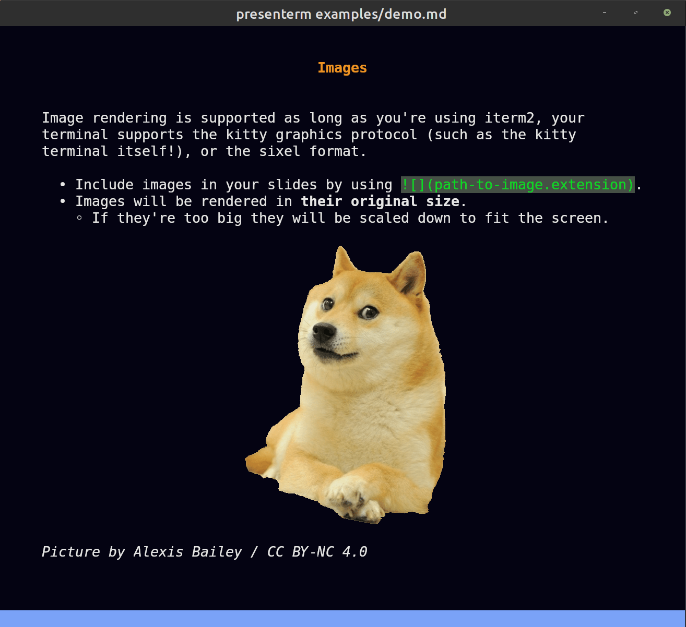

## Introduction

This guide teaches you how to use _presenterm_. At this point you should have already installed _presenterm_, otherwise 
visit the [installation](installation.html) guide to get started.

### Quick start

Download the demo presentation and run it using:

```shell
git clone https://github.com/mfontanini/presenterm.git
cd presenterm
presenterm examples/demo.md
```

## Presentations

A presentation in _presenterm_ is a single markdown file. Every slide in the presentation file is delimited by a line 
that contains a single HTML comment:

```html
<!-- end_slide -->
```

Presentations can contain most commonly used markdown elements such as ordered and unordered lists, headings, formatted 
text (**bold**, _italics_, ~strikethrough~, `inline code`, etc), code blocks, block quotes, tables, etc.

### Images



Images are supported and will render in your terminal as long as it supports either the [iterm2 image 
protocol](https://iterm2.com/documentation-images.html), the [kitty graphics 
protocol](https://sw.kovidgoyal.net/kitty/graphics-protocol/), or [sixel](https://saitoha.github.io/libsixel/). Some of 
the terminals where at least one of these is supported are:

* kitty
* iterm2
* wezterm
* foot

Note that sixel support is experimental so it needs to be explicitly enabled via the `sixel` configuration flag:

```shell
cargo build --release --features sixel
```

> **Note**: this feature flag is only needed if your terminal emulator only supports sixel. Many terminals support the 
> kitty or iterm2 protocols so this isn't necessary.

---

Things you should know when using image tags in your presentation's markdown are:
* Image paths are relative to your presentation path. That is a tag like `` will be looked up at 
  `$PRESENTATION_DIRECTORY/food/potato.png`.
* Images will be rendered by default in their original size. That is, if your terminal is 300x200px and your image is 
200x100px, it will take up 66% of your horizontal space and 50% of your vertical space.
* The exception to the point above is if the image does not fit in your terminal, it will be resized accordingly while 
  preserving the aspect ratio.
* If your terminal does not support any of the graphics protocol above, images will be rendered using ascii blocks. It 
  ain't great but it's something!

#### Image size

The size of each image can be set by using the `image:width` or `image:w` attributes in the image tag. For example, the 
following will cause the image to take up 50% of the terminal width:

```markdown

```

The image will always be scaled to preserve its aspect ratio and it will not be allowed to overflow vertically nor 
horizontally.

#### Protocol detection

By default the image protocol to be used will be automatically detected. In cases where this detection fails (e.g. when 
running inside `tmux`), you can set it manually via the `--image-protocol` parameter or by setting it in the [config 
file](configuration.html#preferred-image-protocol).

## Extensions

Besides the standard markdown elements, _presenterm_ supports a few extensions.

### Introduction slide

By setting a front matter at the beginning of your presentation, you can configure the title, sub title, and author of 
your presentation and implicitly create an introduction slide:

```markdown
---
title: My first presentation
sub_title: (in presenterm!)
author: Myself
---
```

All of these attributes are optional so you're not forced to set them all.

#### Multiple authors

If you're creating a presentation in which there's multiple authors, you can use the `authors` key instead of `author`
and list them all this way:

```markdown
---
title: Our first presentation
authors:
  - Me
  - You
---
```

### Slide titles

Any [setext header](https://spec.commonmark.org/0.30/#setext-headings) will be considered to be a slide title and will 
be rendered in a more slide-title-looking way. By default this means it will be centered, some vertical padding will be 
added and the text color will be different.

~~~
Hello
===
~~~

> Note: see the [themes](themes.html) section on how to customize the looks of slide titles and any other element in a 
> presentation.

### Pauses

Pauses allow the sections of the content in your slide to only show up when you advance in your presentation. That is, 
only after you press, say, the right arrow will a section of the slide show up. This can be done by the `pause` comment 
command:

```html
<!-- pause -->
```

### Ending slides

While other applications use a thematic break (`---`) to mark the end of a slide, _presenterm_ uses a special 
`end_slide` HTML comment:

```html
<!-- end_slide -->
```

This makes the end of a slide more explicit and easy to spot while you're editing your presentation. See the 
[configuration](/docs/config.md#implicit_slide_ends) if you want to customize this behavior.

If you really would prefer to use thematic breaks (`---`) to delimit slides, you can do that by enabling the 
[`end_slide_shorthand`](configuration.html#end_slide_shorthand) options.

### Jumping to the vertical center

The command `jump_to_middle` lets you jump to the middle of the page vertically. This is useful in combination
with slide titles to create separator slides:

```markdown
blablabla

<!-- end_slide -->

<!-- jump_to_middle -->

Farming potatoes
===

<!-- end_slide -->
```

This will create a slide with the text "Farming potatoes" in the center, rendered using the slide title style.

### Explicit new lines

The `newline`/`new_line` and `newlines`/`new_lines` commands allow you to explicitly create new lines. Because markdown 
ignores multiple line breaks in a row, this is useful to create some spacing where necessary:

```markdown
hi

<!-- new_lines: 10 -->

mom

<!-- new_line -->

bye
```

### Incremental lists

Using `<!-- pause -->` in between each bullet point a list is a bit tedious so instead you can use the 
`incremental_lists` command to tell _presenterm_ that **until the end of the current slide** you want each individual 
bullet point to appear only after you move to the next slide:

```markdown
<!-- incremental_lists: true -->

* this
* appears
* one after
* the other

<!-- incremental_lists: false -->

* this appears
* all at once
```

## Key bindings

Navigation within a presentation should be intuitive: jumping to the next/previous slide can be done by using the arrow 
keys, _hjkl_, and page up/down keys.

Besides this:

* Jumping to the first slide: `gg`.
* Jumping to the last slide: `G`.
* Jumping to a specific slide: `<slide-number>G`.
* Exit the presentation: `<ctrl>c`.

### Configuring key bindings

If you don't like the default key bindings, you can override them in the [configuration 
file](configuration.html#key-bindings).

## Modals

_presenterm_ currently has 2 modals that can provide some information while running the application. Modals can be 
toggled using some key combination and can be hidden using the escape key by default, but these can be configured via 
the [configuration file key bindings](configuration.html#key-bindings).

### Slide index modal

This modal can be toggled by default using `control+p` and lets you see an index that contains a row for every slide in 
the presentation, including its title and slide index. This allows you to find a slide you're trying to jump to 
quicklier rather than scanning through each of them.

[](https://asciinema.org/a/1VgRxVIEyLrMmq6OZ3oKx4PGi)

### Key bindings modal

The key bindings modal displays the key bindings for each of the supported actions.

## Hot reload

Unless you run in presentation mode by passing in the `--present` parameter, _presenterm_ will automatically reload your 
presentation file every time you save it. _presenterm_ will also automatically detect which specific slide was modified 
and jump to it so you don't have to be jumping back and forth between the source markdown and the presentation to see 
how the changes look like.

[](https://asciinema.org/a/bu9ITs8KhaQK5OdDWnPwUYKu3)
