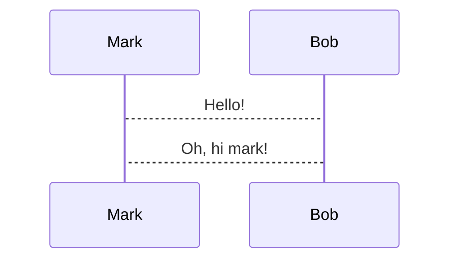

# Mermaid

[mermaid](https://mermaid.js.org/) snippets can be converted into images automatically in any code snippet tagged with 
the `mermaid` language and a `+render` tag:

~~~markdown

~~~

**This requires having [mermaid-cli](https://github.com/mermaid-js/mermaid-cli) installed**.

Note that because the mermaid CLI will spin up a browser under the hood, this may not work in all environments and can 
also be a bit slow (e.g. ~2 seconds to generate every image). Mermaid graphs are rendered asynchronously by a number of 
threads that can be configured in the [configuration file](configuration.html#snippet-rendering-threads). This 
configuration value currently defaults to 2.

The size of the rendered image can be configured by changing:
* The `mermaid.scale` [configuration parameter](configuration.html#mermaid-scaling).
* Using the `+width:<number>%` attribute in the code snippet.

For example, this diagram will take up 50% of the width of the window and will preserve its aspect ratio:

~~~markdown

~~~

It is recommended to change the `mermaid.scale` parameter until images look big enough and then adjust on an image by 
image case if necessary using the `+width` attribute. Otherwise, using a small scale and then scaling via `+width` may 
cause the image to become blurry.
